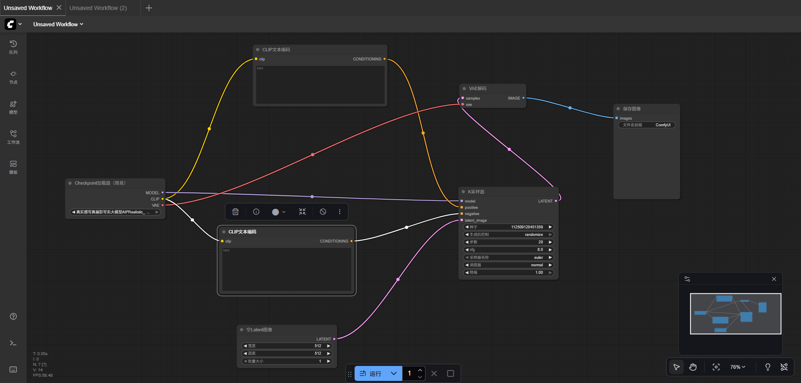

# ComfyUI功能介绍

# 板块一：课程概述

## 一、课程回顾

1. 认识了 **ComfyUI 的定位与基础概念**，理解它是面向 Stable Diffusion 的节点式工作流“工作台”，以及与模型“大脑”的关系。
2. 理解了 **学习 ComfyUI 的意义与发展价值**，知道它能让 AI 创作实现可控、可复现、可批量、可集成，从“玩 AI”升级为“用 AI 工作 / 做项目”。
3. 了解了 **ComfyUI 在电商、游戏影视、教育科研、建筑设计、自媒体等行业中的典型应用**，以及自定义节点、模型融合、工作流模板等延展能力。
4. 掌握了 **ComfyUI 本地部署的基础流程与文件结构**，包括下载安装方式、启动脚本的区别、模型存放路径以及生成图片的输出位置。

## 二、学习目标

1. 理解 ComfyUI 基础功能块的作用与工作原理
2. 掌握基础文生图（Text-to-Image）工作流的搭建方法
3. 根据提示词与参数对生成结果进行基础调控
4. 达到具备独立使用 ComfyUI 完成简单图像生成的能力

## 三、课程目录

1. 功能块介绍
2. 搭建基础工作流

# 板块二：课程章节

## 一、功能块介绍

- 打开之后大概都是这套默认的工作流。

### （一）Checkpoint加载器

- 参考图片
    
    
    
- 作用：说简单点，他的用处就是选择大模型。

### （二）ClIP文本编码

- 参考图片
    
    
    
- 定义：ClIP文本编码的作用是 **“文本理解模型”**，**把文字 Prompt 转化为模型能理解的语义向量，**然后这个语义向量会被送入 UNet 影响图像生成。简单来说就是，生成让工作流能听得懂的语言。
- 注意：ClIP文本编码一般需要两个，我们可以称呼他们为”正提示词“、”负提示词“。这两套提示词的作用：
    - 正向提示词：告诉模型“生成什么”
    - 反向提示词：告诉模型“避免什么”

### （三）K采样器

- 图片参考
    
    
    
- **作用**
    - 相当于手机的芯片，所有的信息与数据都汇集过来
    - 控制从随机噪声逐步生成图像的“去噪过程”
    - 决定画面细节、清晰度、风格倾向与生成速度
- **核心输入内容**
    - **模型（Model）**：来自 Checkpoint Loader，用来“画图”
    - **正向语义（Positive）**：来自正提示词的 CLIP 编码
    - **反向语义（Negative）**：来自负提示词的 CLIP 编码
    - **初始噪声（Latent / Noise）**：生成图像的起点
- **关键参数**
    - **Sampler（采样算法）**
        - 决定“画图的线条风格与细化方式”
        - Eular、DPM++、Heun 等各自有不同效果
    - **Steps（步数）**
        - 越大越细腻，但超过某个区间后提升变弱
        - 常用范围：20–35
    - **CFG Scale（提示词影响强度）**
        - 数值越高越“听话”，但可能不自然
        - 常用范围：5–10
    - **Seed（随机种子）**
        - 控制画面可复现性
        - 相同 Seed + 相同参数 = 完全相同画面

### （四）空Latent

- 图片参考：
    
    
    
- **作用**
    - 用来**创建一个“空白的潜空间图像”作为生成起点。简单来说**相当于给模型提供 **一张“看不见的空白画纸”**
    - 是 **文生图（Text to Image）** 工作流的默认起点
- **关键参数**
    - **宽度（Width）与高度（Height）**
        - 决定最终图像分辨率
        - 模型最常见基础尺寸：
            - SD1.5：512 × 512
            - SDXL：1024 × 1024
    - **Batch（批量生成数量）**
        - 决定一次要生成多少张图

### （五）VAE解码

- 图片参考
    
    
    
- **作用**
    - 将 **latent（潜空间数据）→ 转换为可见图像**
    - 是 **“把模型脑子里画好的图”变成真正的图片** 的步骤
- 为什么要解码
    - Stable Diffusion **不是直接在真实图片上作画**，而是先在一种叫 **latent（潜空间）** 的压缩信息格式里“画草稿”。
    - 你可以把它理解成：
        - latent = 压缩版的图片（只有AI能看懂）
        - VAE解码 = 解压回真正的图片
- **核心原理**
    - Stable Diffusion 并不是直接在 RGB 图像上生成
    - 它是在 **低维潜空间（latent space）** 中工作，效率更高
    - **VAE 解码 = 将 latent 解压/重建为真实分辨率图片**
- **关键影响点**
    - **VAE 类型决定画面色彩、光影、质感**
    - 不同 VAE 会产生不同：
        - 皮肤柔和度
        - 颜色饱和度
        - 对比度 & 纹理表现
- **常见表现差异**
    - **好 VAE**：颜色正常、细节清晰、皮肤自然
    - **差 VAE / 不匹配的 VAE**：画面灰、糊、对比度低、发白发雾

### （六）保存图像

- 图像参考：
    
    
    
- 作用：图像生成的地方，最终图像会在这个地方展示

## 二、搭建基础工作流

### （一）基本工作流搭建

- Checkpoint加载器
    - 接收：/
    - 输出：
        - model：传给K采样器（model）
        - clip：传给CLIP文本编码（正负提示词）
        - vae：传给VAE解码（ave）
- CLIP文本编码（正/负提示词）
    - 接收：
        - clip：由Checkpoint加载器传输
    - 输出：
        - 正提示词：K采样器的psditive
        - 负提示词：K采样器的negative
- 空Latent图像
    - 接收：/
    - 输出：
        - latent：交给K采样器作为初始潜空间（latent_image）
- K采样器
    - 接收：
        - model：由Checkpoint加载器传输
        - positive：由正提示词传输
        - negative：由负提示词传输
        - latent_image：由空Latent图像传输
    - 输出：
        - latent：输出给VAE解码器（samples）
- VAE解码（VAE Decode）
    - 接收：
        - samples：由K采样器传输
        - vae：由Checkpoint加载器传输
    - 输出：保存图像

### （二）生成图片

- 当把上一步的工作流搭建完成后，就可以进行基本的图像生成
- 图片参考：
    
    
    
- 点击运行，就可以生成对应的图片了。

# **板块三：课后作业**

- 自己可以动手尝试生成几张图片