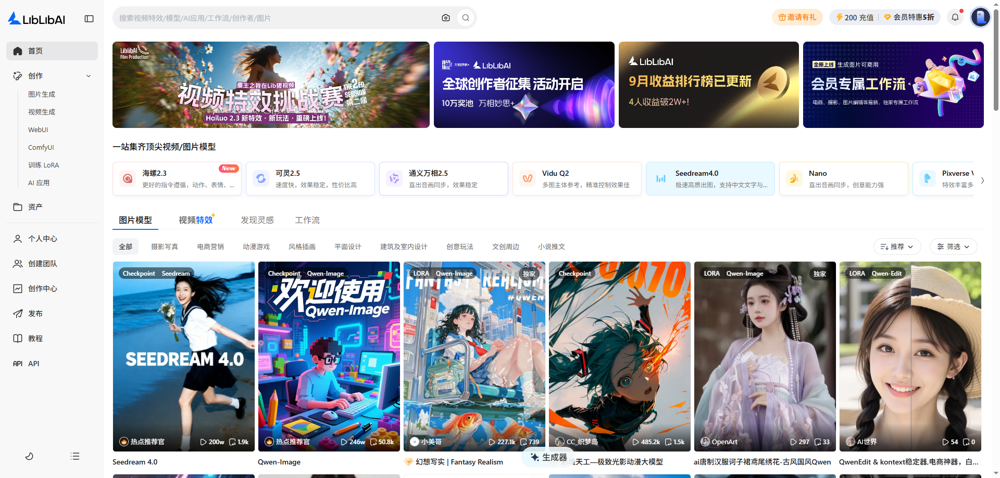

# AIGC有关网站与模型下载

# 板块一：课程概述

## 一、课程回顾

1. **理解了 ComfyUI 的基础功能块与核心作用**
2. **掌握了基础文生图（Text-to-Image）流程的节点关系**
3. **学会了搭建最基本的文生图工作流**
4. **掌握了使用 ComfyUI 生成简单图像的基本能力**

## 二、学习目标

1. 理解 Stable Diffusion 相关的核心基础概念
2. 明确 ComfyUI 学习的重点与方向
3. 认识常用模型站点及其侧重点
4. 理解常见图片模型类型及适用风格
5. 掌握从网站下载模型并导入 ComfyUI 的基本流程

## 三、课程目录

1. 概念讲解
2. 模型网站介绍及下载方式

# 板块二：课程章节

## 一、概念讲解

### （一）必备基础概念

- **Stable Diffusion**
    - 解释：一种 AI 图像生成模型，通过“扩散-反扩散”生成图片。
    - 用途：ComfyUI 本质就是给 Stable Diffusion “搭积木”，而 Stable Diffusion 就像一个人的大脑，由ComfyUI来充当手脚，共同完成“搭积木”这件事。
- **Checkpoint**
    - 解释：模型的主要权重文件，决定生成的画风和能力。
    - 用途：ComfyUI 工作流里经常要加载 checkpoint。
- **LoRA**
    - 解释：小型模型微调文件，用来强化特定风格或角色。
    - 用途：ComfyUI 中经常要把 LoRA 插入模型流中。
- **VAE**
    - 解释：控制图像输出的色彩和细节风格。
    - 用途：常见问题如“画面灰、糊、偏色”大多是 VAE 没配好。
- **CLIP**
    - 解释：把你的提示词转成模型能理解的向量。
    - 用途：ComfyUI 中经常要把 LoRA 插入模型流中。
- **采样器**
    - 解释：负责“反扩散”，控制画面质量与细节。
    - 用途：不同 sampler 会影响生成速度、细腻程度。
- **CFG Scale**
    - 解释：“提示词遵从度”参数，数值越高越偏向你写的 Prompt。
    - 用途：提示词控制效果很关键。

### （二）ComfyUI 的学习重点

| 项目 | 内容说明 | 学习重点 |
| --- | --- | --- |
| **节点 (Node)** | 每个节点是一个独立功能模块 | 理解节点输入/输出是什么类型 |
| **工作流 (Workflow)** | 节点连接形成的处理链 | 先使用别人现成工作流进行分析 |
| **模型路径配置** | 模型放到 `ComfyUI/models/` 对应子目录 | 解决“模型读不到”的常见问题 |
| **多模型组合** | 如 Checkpoint + LoRA + VAE | 理解加载顺序、混合方式 |

## 二、模型网站介绍及下载方式

### （一）模型网站介绍

- LibLibAI（哩布哩布AI）
    - 图片参考：
        
        
        
    - 网址：[https://www.liblib.art/](https://www.liblib.art/)
    - 类型： 国内模型资源分享站。
    - 特点：
        - 提供大量 汉化与本地化 LoRA / 模型，对中文用户友好。
        - 支持 直接预览模型风格，对选择模型非常方便。
        - 网站访问速度快、下载速度可直接满速（国内优势）。
    - 优点：
        - 中文 LoRA 资源最丰富之一，适合动漫 / 二次元 / 国风。
        - 适合 ComfyUI 用户直接拿来构建工作流。
    - 风险与注意：
        - 有部分模型来源于 其他站点转存，需要自己留意版权/作者授权情况。
        - 部分模型质量参差不齐，需要多对比评价与样例。
    - 适用：
        - 新人找好用的 LoRA / 动漫模型
        - 想构建 ComfyUI 风格工作流
- NovelAI.Dev
    - 图片参考：
        
        
        
    - 网址：[https://novelai.dev/](https://novelai.dev/)
    - 特点：以二次元为主的模型万盏，它不属于 NovelAI 官方，也不是官方模型源，是一个第三方模型资源收集站。
    - 优点：动漫模型分类清晰、模型风格趋统一、LoRA 可控性较好、对新手友好
    - 适用：
        - 喜欢 Anime / 二次元立绘 / Galgame 风格 的用户
        - 尤其适合做：角色立绘、人设图、插画封面、立绘表情套件
    - 特别提及：
        
        
        
        - ”法术解析“可以反推出你生成图片的参数，包括比例大小、正反向提示词、使用什么模型等。
- Promlib（大概率你指的是 PromptLib / Prompthero / 文案提示库）
    - 参考图片：
        
        
        
    - 网址：[https://promlib.com/](https://promlib.com/)
    - 类型： 这是一个提示词网站。
    - 特点：
        - 包含种类丰富（光是人物就有女性发型、男性发型、发色、人物、脸部、眼睛、耳朵、嘴、皮肤）
        - 帮助你理解提示词构成、权重、风格描述语言。
        - 可以看到别人是如何写提示词的。
- CivitAI（你写成 CivitAl）
    - 图片参考
        
        
        
    - 网址：[https://civitai.com/](https://civitai.com/)（需要魔法上网）
    - 类型： 全球最大的 Stable Diffusion 模型与 LoRA 社区
    优点：
        - 模型库非常非常大，种类、风格也是最全的。
        - 有详细标签、评分和示例图。
        - ComfyUI 工作流分享最丰富。
    - 缺点：
        - 国内访问速度较慢。
        - 需要魔法上网
        - 有部分模型内容尺度较高（NSFW），注意筛选。
    - 适用：
        - 寻找 高质量模型 / LoRA / 工作流
        - 想了解模型趋势与新技术的用户
- 总结：接下来的教学，我们以

### （二）图片模型介绍

- **Seedream**
    - 说明：适合角色立绘、插画，细节表现好
    - 适用风格：**精细动漫 / 国漫**
- Qwen-Image
    - 说明：支持 ComfyUI/Forge，本地可跑但显存开销较大
    - 适用风格：**泛用现实/动漫混合表达**
- Qwen-Edit
    - 说明：常用于 **换脸、修图、局部改动**
    - 适用风格：根据原图编辑，不负责创作
- 基础算法 v1.5 / F.1 / XL
    - 说明：需搭配 **LoRA/风格模型** 才能出图好看
    - 适用风格：**中性基础，不带风格**
- Illustrious / IllustriousXL
    - 说明：人物表现温和，适合同人
    - 适用风格：**日系插画、清爽色彩**
- Pony
    - 说明：LoRA 资源多，非常实用
    - 适用风格：**可爱系 / 角色一致性好**
- NoobAI
    - 说明：肤色自然、真实感好
        - 适用风格：**摄影人像**
- Kolors
    - 说明：可本地运行，质量稳定
    - 适用风格：叙事感插画、柔和现实
- HiDream
    - 说明：成品有“国风插画流感”
    - 适用风格：明亮饱和色、柔性动漫插图
- Kontext / IMG1
    - 说明：需要结合 **正向 prompt 写法** 才能体现优势
    - 适用风格：多为 **中性写实 / 插画增强型**

### （三）模型下载及导入

- 我们以”LibLibAI（哩布哩布AI）“来演示下载流程
    - 第一步：打开网页
        
        
        
    - 第二步：点击筛选，在”模型类型“中选择”**Checkpoint** “。
        
        
        
    - 第三步：选择你需要的图片类型
        
        
        
    - 第四步：点击你选择的模型，进入下载页面
        
        
        
    - 第五步：点击”下载加密模型“
        
        
        
- 导入模型
    - 将下载好的模型复制到对应的文件夹，比如刚才我们选择的模型类型是”**Checkpoint** “，在下载的ComfyUI中找到对应的文件夹，然后将下载好的模型复制进去。
        
        
        
    - 复制进去后就可以在在软件中使用了

# **板块三：课后作业**

- 基于上节课下载好的ComfyUI，自己动手尝试下载模型，并将模型导入对应的文件夹里面。