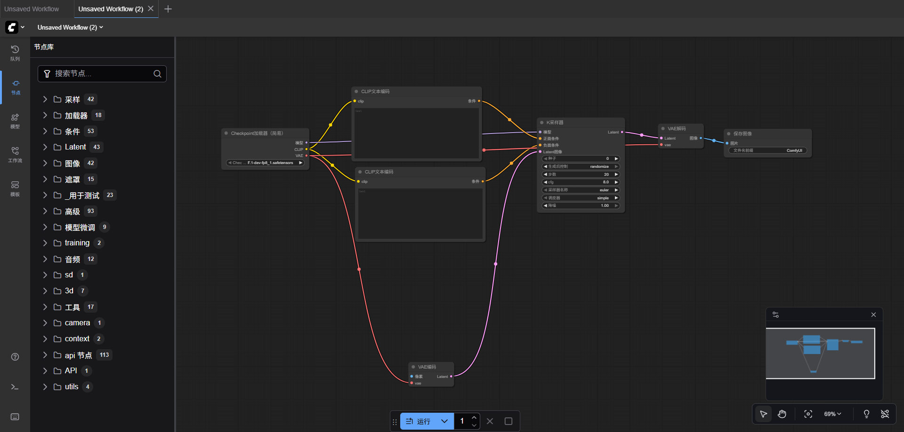

# 图生图与运行逻辑

# 板块一：课程概述

## 一、课程回顾

1. **了解文生图（Text-to-Image）的发展脉络与核心理念**
2. **掌握文生图的核心运行逻辑**
3. **认识文本编码的重要性与基本原理**如何影响生成结果。
4. **学习并运用提示词（Prompt）的结构、写法与优化技巧**

## 二、学习目标

1. **了解了图生图（Image-to-Image）的概念与发展脉络**
2. **掌握了图生图技术从传统算法 → GAN → 扩散模型的演进过程**
3. **认识了图生图的核心运行逻辑**
4. **学习了在 ComfyUI 中搭建并使用基础图生图工作流的方法**

## 三、课程目录

1. 图生图的基本概念与发展脉络
2. 图生图的运行逻辑
3. 图生图在ComfyUI中的实际应用

# 板块二：课程章节

## 一、图生图的基本概念与发展脉络

### （一）图生图的定义与特征

- **概念说明**：
    
    图生图（Image-to-Image Generation）是指通过输入一张已有图像，结合算法模型或文本提示词，对其进行风格、结构或内容的再生成过程。
    
- **与文生图的区别**：
    - “文生图”是指AI通过文字描述从零生成图像的技术，它依靠自然语言理解模型，将提示词转化为视觉元素，再通过扩散模型一步步从噪声中“想象”出完整画面。这种方式自由度高，适合从无到有的创作，如概念设计、AI插画或视觉灵感探索，但对构图和细节的控制相对较弱。简单来说就是通过文字的描述来生成图片
    - “图生图”则是在已有图像基础上进行再创作的技术。AI会读取原图的结构、线条、姿态等信息，再结合提示词进行风格替换、内容补充或画面修复，实现风格迁移、草图精绘、动漫化、照片上色等多种应用。相比文生图，它更强调结构可控和风格统一，适合改图与艺术精修场景。简单来说就是参考从“图像”到“图像”，更注重保留结构与风格变换。
- **典型应用场景**：
    - 草图转精绘
        - 草图转精绘是图生图最直观的应用之一，用户只需提供简单的线稿或草图，模型便能在保留基本结构的同时自动补全色彩、光影与细节，生成完整的艺术化作品。该过程通过识别线条与轮廓特征，将其作为形态参考，并结合提示词中的风格描述进行风格化渲染，如将手绘人物草稿转化为动漫插画、建筑草图变为写实渲染图等。此应用常借助 ControlNet 的 Canny、Lineart 或 Scribble 模型来稳定结构，在参数上通常使用较低的噪声强度（Denoising Strength 0.3–0.5）以保持原图形态，是概念设计、产品原型可视化与艺术创作中最常用的AI辅助方式之一。
    - 风格迁移
        - 风格迁移的核心在于让图像的结构保持不变，同时将其视觉表现方式替换为目标风格，如将照片转化为油画、水彩或像素艺术效果。模型通过分离“内容特征”和“风格特征”，再在潜空间中进行特征融合，最终实现画风的重构。这种方法广泛用于艺术作品风格化、品牌视觉统一和跨领域视觉表达，例如将同一场景渲染为“莫奈印象派”或“宫崎骏动画风”。在实际操作中，可通过提示词强化目标风格（如“in the style of Van Gogh”），并结合 LoRA 模型或 DreamBooth 进行个性化训练，从而形成稳定的个人风格或系列化视觉语言。
    - 图像修复与扩展
        - 图像修复（Inpainting）与图像扩展（Outpainting）是图生图技术在图像编辑领域的核心应用。Inpainting 通过掩膜（Mask）选定局部区域，让模型在语义一致的前提下重新生成该区域内容，可用于去除人物、修复旧照片、修改背景或替换服装；Outpainting 则是向外延展画布，让AI在原图风格与光线一致的情况下自动补全新的画面部分，常用于电影级构图、壁纸延展或横幅设计。两者都体现了图生图在结构理解与语义重建上的优势，通过合理设置提示词（如“consistent lighting, same composition”）和适中噪声控制，可实现自然衔接且细节丰富的效果。
    - 风格重绘
        - 风格重绘是在保持原图语义与构图基础上，对整体视觉风格进行再创作的过程，是图生图中兼具艺术表达与控制力的高级应用。它不仅可以让人物照片动漫化、插画写实化，还能实现多种创意转化，如赛博朋克风、古典油画风或未来科技感风格。模型会分析输入图像的语义结构与颜色关系，并在扩散过程中重构纹理、光影与笔触。提示词与负面提示的设计在此尤为关键，例如通过“anime style, soft lighting, detailed eyes”即可生成自然的二次元风格人像。风格重绘广泛应用于影视视觉设计、游戏概念图、品牌角色视觉统一等领域，让创作者能以极低成本实现高质量艺术化输出。
    - 多图融合与创意扩展（Advanced Image Blending）
        - 多图融合是图生图的进阶应用形式，通过输入多张参考图像在潜空间中融合其特征，从而创造出兼具多个视觉元素的新图像。这种方式不仅能实现角色换装、场景合成、跨风格融合，还可以生成统一构图下的系列图像，提升创作一致性。与之相辅的还有纹理生成与材质合成应用，可从单一参考图出发生成连续可平铺的纹理图，用于游戏、UI或建筑渲染。多图融合强调结构与语义的协调，可借助 ControlNet、T2I Adapter 或深度图控制模块保持构图一致，在创意设计、广告合成、角色视觉延展与概念艺术中展现出强大的创新潜力。

### （二）图生图技术的发展阶段

- **传统算法阶段**：在早期的图像处理阶段，图生图主要依赖于传统图像算法，如滤镜、边缘检测、模板匹配、梯度混合和直方图调整等方式来实现“风格迁移”或“修复”效果。这些方法没有学习能力，仅基于像素或特征层面的变换规则。
- **神经网络阶段**：这一阶段的关键突破在于模型能通过数据学习“结构与风格”的关系，具备一定的语义理解能力。但GAN类模型存在训练不稳定、模式崩塌（Mode Collapse）等问题，生成质量虽高但可控性差。此外，这一时期的模型往往需要成对数据训练，限制了其在通用创作中的灵活性。
    - “GAN类模型”指的是生成对抗网络这一类别的模型。GAN是一种深度学习模型，由生成器（Generator）和判别器（Discriminator）两部分组成。
- **扩散模型阶段（Diffusion-Based I2I）**：模型的出现彻底改变了图生图的生成逻辑。其核心思想是通过“噪声—去噪”的可逆过程，在潜空间中逐步重建高质量图像。在图生图任务中，模型会先将输入图像编码为潜空间特征，然后在不同噪声强度下采样生成新的图像。用户可以通过控制“去噪步数”“噪声强度”“CFG Scale”等参数来平衡内容保真与风格创新。

## 二、图生图的运行逻辑

### （一）整体工作流程概览

- 图生图（Image-to-Image Generation）的运行逻辑，本质上是**图像潜空间的“再采样与重构”过程**。系统会将输入图像压缩为潜空间表示（Latent Representation），结合提示词或控制条件，对其进行噪声扰动与语义修正，再经由解码器输出新的图像结果。
- 典型运行流程：
    - **输入**：原始图像 + 提示词 + 参数设定（如CFG Scale、Denoising Strength）。
    - **编码**：通过Encoder（如VAE Encoder）将输入图像映射至潜空间向量。
    - **条件融合**：结合文本嵌入、边缘图、深度图、姿态图等控制信号。
    - **扩散采样（Diffusion Sampling）**：模型对潜空间添加或移除噪声，实现结构与风格的调整。
    - **解码输出**：通过VAE Decoder重建成像，输出新的图像结果。

### （二）核心算法逻辑：扩散模型的逆向过程

- 图生图的核心机制源自扩散模型（Diffusion Model）的“去噪采样”过程。
    - **正向扩散（Forward Process）**：
        
        模型逐步在输入图像中添加噪声，使其变为潜空间随机噪声；
        
    - **逆向生成（Reverse Process）**：
        
        神经网络（通常为U-Net结构）通过学习的分布逐步“去噪”，恢复图像；
        
    - **文本条件控制（Conditioned Sampling）**：
        
        模型利用提示词（Text Embedding）引导逆向过程，控制语义方向；
        
    - **图像潜变量控制（Latent Guidance）**：
        
        将原图潜变量与扩散过程中的随机变量混合，保持结构一致性。
        
- **可理解为：**
    - 模型一边“记得”原图结构，一边“听从”提示词的指令，在噪声空间中寻找两者的平衡点。+

## 三、图生图在 ComfyUI 中的实际应用

### （一）搭建图生图基础工作流

- 参考：
    
    
    
- 应用到的节点：
    - Checkpoint加载器(简易)
    - CLIP文本编码
    - VAE编码
    - K采样器
    - VAE解码
    - 保存图像

### （二）运行操作

- 第一步：上传你想要修改的图片
    
    
    
    
    
- 第二步：输入正反提示词
- 第三步：注意“降噪值”
    
    
    
    - 0.3-0.5之间属于安全的重绘幅度区间
    - 0.5-0.7会赋予AI更多的想想空间
    - 注意，无论是低于0.3还是高于0.7都会使图像发生扭曲变形
- 第四步：选择好模型，点击运行即可
    
    
    

# **板块三：课后作业**

- 自己可以动手尝试进行图生图的任务