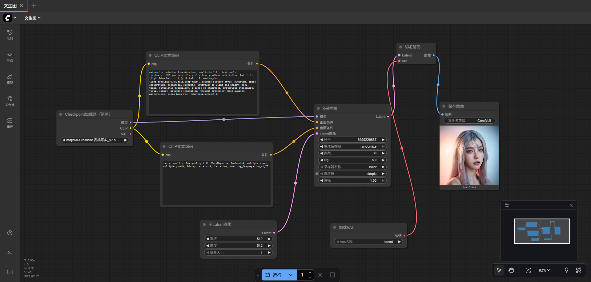

# 高清放大与细节添加

# 板块一：课程概述

## 一、课程回顾

1. 了解了图生图（Image-to-Image）的概念与发展脉络
2. 梳理了图生图从传统算法 → GAN → 扩散模型的演进路径
3. 掌握了图生图的核心运行逻辑与关键参数
4. 学会在 ComfyUI 中搭建并使用基础图生图工作流

## 二、学习目标

1. 理解高清放大的必要性，识别其在电商设计、摄影后期、AI生成图后处理、视频关键帧放大等实际业务中的价值。
2. 熟悉在 ComfyUI 中完成高清放大的完整流程
3. 能独立完成一次“高清放大 + 细节添加”的完整实操

## 三、课程目录

1. 高清放大的应用场景
2. 在ComfyUI中高清放大与斜街添加的流程

# 板块二：课程章节

## 一、高清放大的应用场景

### （一）实际业务场景中的高清放大需求

- 电商主图与产品图优化
    - 情况：
        - 原始图像像素过低、细节不够精致。
        - 高清放大后才能用于淘宝、亚马逊等平台要求的高分辨率展示。
    - 需求：布纹增强、金属质感增强、文字清晰化。
- 摄影后期修复与画质提升
    - 情况：旧照片模糊、噪点过多。
    - 需求：高清修复可恢复面部纹理与衣物结构。
    - AI 生成图的统一清晰流程
    - 情况：生成的图往往不足高清级别。
    - 需求：高清放大可用于：海报、插画、输出打印。
- 视频 AI 场景（关键帧放大）
    - 情况：AI 视频常常需要对关键帧进行放大/锐化，确保整体视频质量一致。

### （二）高清放大与细节添加在comfyui中的作用

- **提升图像分辨率**
    - 高清放大（Upscale）的核心作用是在不改变原始画面结构的前提下，将图像从低分辨率提升到高分辨率。
    - 它的价值在于：
        - 让生成图可以用于打印、海报、商业设计
        - 提升局部清晰度，消除模型生成时常见的模糊
        - 支持更大幅面裁切与继续加工
- **增强局部细节**
    - 高清放大通常伴随“细节增强”，即让纹理、材质、头发、皮肤、布料等区域更加真实。
    - 其作用包括：
        - 修复AI生成中常见的涂抹感、过度平滑
        - 添加细节纹理，如皮肤毛孔、头发丝、布料纹理
        - 使画面更真实，提高视觉质量
        - 让图像的艺术风格更统一
- **保障角色面部质量**
    - 对人物生成来说，高清放大与细节添加对于“保证脸部质量”非常重要。
    - 可以修复：
        - 补强眼睛、嘴唇、睫毛等细节
        - 修正歪脸、塌鼻子、眼睛对称性问题
        - 保持面部风格一致而不变形

## 二、在ComfyUI 中高清放大与细节添加的流程

### （一）图片锁定

- 为了方便后续学习放大技巧和细节添加技巧，我们要先生成一版基础图片
    - 参考图片：
    
    
    
- 现在我们要把这个图片固定，方便后续的修改。点击“生成后控制”，选择“fixed”。
    - 操作流程：
    
    
    

### （二）高清放大

- 在K采样器后面的latent输出拖出个节点，按住shift建搜索“缩放”。会出现两个缩放
    - 一个是按比例缩放
    - 一个是按尺寸缩放
    
    
    

### （三）细节添加

在”基本生图工作流“的基础上进行调试

- 第一步：先用ctrl+c复制K采样器，再点击空白处按ctrl+shift+v进行粘贴，这样粘贴会把以前的连接线也给粘贴过来。
    
    
    
- 第二步：把“缩放Latent(比例)”的latent连接到k采样器上
    
    
    
- 第三步：把组进行区域划分，让他们看起来更清晰一点。右键空白处，点击“添加组”
    
    
    
    再将第一步和第二步制作的节点托放进去，这样一来，只要拖动组，里面的节点就会跟随移动。
    
    
    
    我也还可以为之前的“基础生图流程”建立一个组别
    
- 第四步：把“图片调试”中的“K采样器”的latent添加一个“VAE解码”节点
    
    
    
- 第五步：在“基础生图流程”中，把“VAE解码”的连接点，新添加一个“加载VAE”。
    
    
    
- 第六步：把“图片调试”中“VAE解码”的“vae”线连接到“基础生图流程”中的“加载VAE”
    
    
    
- 第七步：在“图片调试”中，“VAE解码”后面再接一个“图像预览”的节点
    
    
    
- 第八步：注意“降噪值”，太高会让AI将图片进行重绘
    
    
    
- 最后的效果图
    
    
    
- 效果对比
    
    
    

# **板块三：课后作业**

- 自己动手尝试修改一张图片