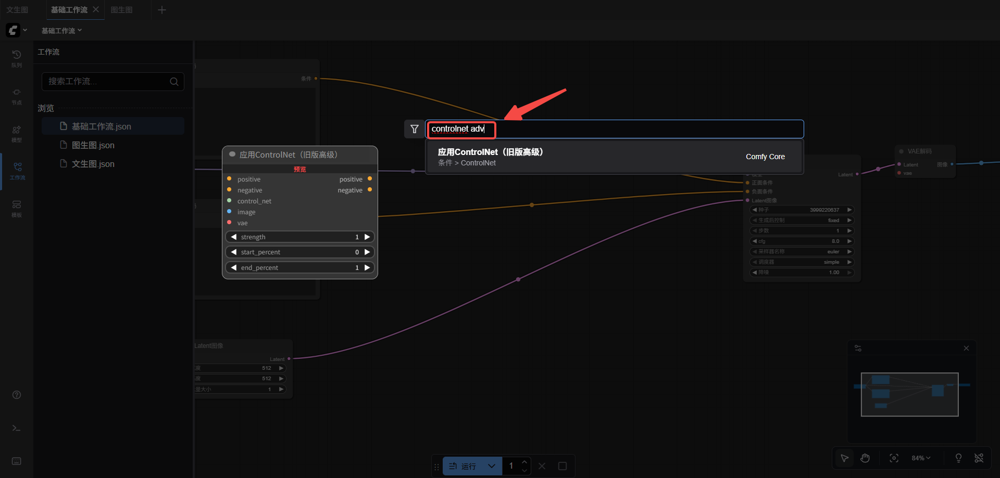

# Controlnet

# 板块一：课程概述

## 一、课程回顾

1. **理解了高清放大的核心价值与实际业务需求**
2. **认识了高清放大与细节增强在 ComfyUI 中的功能作用**
3. **掌握了在 ComfyUI 中完成高清放大的基础流程**

## 二、学习目标

1. 理解 ControlNet 的核心概念与工作原理
2. 能熟练在 ComfyUI 中使用 ControlNet 节点
3. 掌握 Lineart（线稿）模型的作用与使用方法
4. 理解 Softedge（软边缘）模型的特点及工作流

## 三、课程目录

1. Controlnet介绍
2. Lineart线稿
3. Softedge软边缘

# 板块二：课程章节

## 一、Controlnet 介绍

### （一）ControlNet 是什么？

- **定义：为扩散模型添加“可控能力”的结构化网络**
    - ControlNet（由 Lvmin Zhang 团队提出）是专门用于 Stable Diffusion 的扩展网络，可以让模型在生成图像时，严格遵循用户提供的**结构信息**（如线稿、深度、姿态、分割图、边缘等）。
    - 它的核心作用是：**让 AI 不只听提示词，还能根据图像“指令”来生成结果。**
- **原理：锁定低层结构，保留高层自由度**
    - Stable Diffusion 原模型负责风格、材质、光影等高层视觉特征。
    - ControlNet 接管模型的“底层结构”部分，提供可控的几何、线条、姿态等信息。
    - 因此它可以做到：**结构固定 → 风格自由 → 输出可控且美观。**
- **优势总结**
    - 控制力度强，可做到“生成的图像与结构几乎完全一致”
    - 保留创作自由度（风格、材质仍由提示词控制）
    - 提升复杂场景、人物动作、建筑结构的一致性
    - 大幅改善 AI 难以掌控的元素：手指、姿势、透视等

### （二）ControlNet 在 ComfyUI 中有什么用？

- **在 ComfyUI 中，ControlNet 是“模块化、可组合的控制节点”**
    - ComfyUI 的节点系统让 ControlNet 的使用更加灵活，不局限于单一流程。
- **主要用途**
    - **精确控制人物姿态与动作（OpenPose）**
    - **保持构图与形状一致（Canny / Lineart）**
    - **保留空间结构与透视（Depth / Normal）**
    - **实现图像重绘、更换风格、不改变内容**
    - **提升图像稳定性（动画 / 连续帧）**

## 二、Lineart线稿

### （一）Lineart线稿的作用

- Lineart 是什么：
    - **Lineart（线稿）是一种将原始图像转换为纯线条轮廓的技术**，它保留画面的结构、形状、物体边界与笔触感，但去除颜色、纹理、光影等信息。在 AI 绘图中，Lineart 是 ControlNet 的一种模型，用于将线稿作为视觉控制条件输入，从而指导生成图像的整体结构与造型。
    - 简单来说：Lineart = 把图像变成干净的线稿 → 再由 AI 按照线稿生成新图
- Lineart 的核心作用：
    - 控制画面结构
    - 让 AI 生成的画面更稳定
    - 助用户保留“草稿 → 成图”的创作自由度
    - 实现高一致性角色生成

### （二）工作流搭建

- 第一步：空白区域双击，搜索“controlnet adv”，选择“应用ControlNet(旧版高级)”
    
    
    
- 第二步：把“应用ControlNet(旧版高级)”的“ControlNet”添加新节点
    
    
    
- 第三步：下载“controlnet”的相关模型
    - 网址参考：[https://www.liblib.art/modelinfo/839920fec0e14405a3092a38fe0b88e1?from=search&versionUuid=48af64795a1945ab885a4f9a35235964](https://www.liblib.art/modelinfo/839920fec0e14405a3092a38fe0b88e1?from=search&versionUuid=48af64795a1945ab885a4f9a35235964)
- 第四步：下载扩展节点。
    - 第一步：先下载用户管理界面
    网址：[https://github.com/Comfy-Org/ComfyUI-Manager](https://github.com/Comfy-Org/ComfyUI-Manager)
        
        
        
    - 第二步：解压文件
    解压地址：
        
        
        
    - 第三步：重启comfyui。重启后点击、
        
        
        
        
        
    - 第四步：”Filter“设置为”All“后，搜索”controlnet_aux“下载文件
        
        
        
        
        
    - 第五步：再次重启comfyui。
- 第五步：把“应用ControlNet(旧版高级)”的“图像”拖出一个新节点。点击“图像”按住“shift键”，搜索”lineart“，选择”Standard Lineart“
    
    
    
    - 注意：这个节点是处理白底黑边的图片。
- 第六步：在”Standard Lineart“中，拉出一个新节点
    
    
    
- 第七步：上传一个动漫线稿图片
    
    
    
- 第八步：在”Standard Lineart“中，拉出一个新节点
    
    
    
- 第九步：拉出一个”加载VAE“的节点
    
    
    
- 第十步：把剩余的线连接好
    
    
    
- 第十一步：写提示词
    
    
    
- 第十二步：K采样器调试。
参考图
    
    
    
- 最终效果图：
    
    
    

## 三、Softedge软边缘

### （一）Softedge软边缘的作用

- SoftEdge 是什么：
    - 基于边缘检测的一种“柔和版结构提取模型”，它的核心功能是：**通过边缘检测算法提取图像轮廓，但保留柔和过渡、细腻线条，让生成模型在保留原图结构的同时具备更强的创意自由度。**
- SoftEdge 的作用：
    - 保留图像的主要轮廓结构
    - 提供柔和的参考，引导风格生成
    - 减少噪点、乱形、脸部崩坏等问题

### （二）工作流搭建

- 第一步：下载模型
    - 参考网址：[https://huggingface.co/comfyanonymous/ControlNet-v1-1_fp16_safetensors/blob/main/control_v11p_sd15_softedge_fp16.safetensors?utm_source=chatgpt.com](https://huggingface.co/comfyanonymous/ControlNet-v1-1_fp16_safetensors/blob/main/control_v11p_sd15_softedge_fp16.safetensors?utm_source=chatgpt.com)
        
        
        

- 第二步：将下载的文件放置在对应的文件夹中
    
    
    
- 第三步：保存节点，再刷新comfyui。在“Lineart线稿”工作流中进行调整，把“加载ControlNet模型”节点的模型换一下，换成刚刚导入的模型。
    
    
    
- 第四步：删除“Standard Lineart”节点。
    
    
    
- 第五步：双击空白页面搜索“softedge”，选择“HED Soft-Edge Lines”
    
    
    
- 第六步：将“HED Soft-Edge Lines”节点的线，如图连接好。
    
    
    
- 效果图：
    
    
    

# **板块三：课后作业**

- 自己动手尝试这节课学习的内容